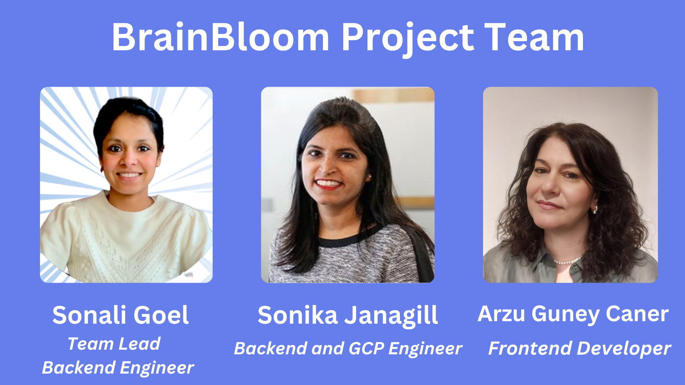

# BrainBloom App

**BrainBloom** is an AI-powered mental health companion designed to nurture emotional well-being through instant, intelligent, and compassionate support.

## 🌸 What Is BrainBloom?
**BrainBloom** is a modular, AI-driven mental wellness system designed to cultivate emotional resilience and well-being. It orchestrates a collaborative team of intelligent agents—each specializing in a key aspect of mental health support. 

### The system is designed to:

- Identify emotional states and assess risk in real-time based on user inputs.
- Automate triage and intelligent escalation for high-risk situations, connecting users to urgent care when necessary.
- Recommend tailored self-care resources and support options that match individual needs and contexts.
- Facilitate empathetic, ongoing dialogue to nurture mental clarity and emotional growth.
- Integrate with external APIs and data sources to deliver current, relevant, and diverse support services.

🌿 We currently use **Bolt** to rapidly prototype our multi-agent architecture. This prototype serves as a foundational platform for efficiently deploying agents that will interface with our backend multi-AI model infrastructure.

- **Sonali Goel** (Backend Engineer) | [Website](https://sonaligoel.carrd.co/) | [GitHub](https://github.com/goelsonali) | [LinkedIn](https://www.linkedin.com/in/sonali-goel-tech/) | 
- **Arzu Caner** (Frontend Engineer) | [GitHub](https://github.com/arzucaner) | [LinkedIn](https://www.linkedin.com/in/arzucaner/) | [YouTube](@Codearz) |
- **Sonika Janagill** (Backend and GCP Engineer) | [GitHub](https://github.com/sjanagill) | [LinkedIn](https://www.linkedin.com/in/sonikaj/) | 

 We would like to express our gratitude to the entire team for their contributions to our project.
